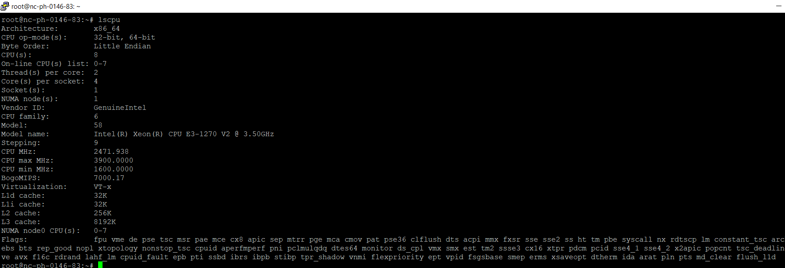
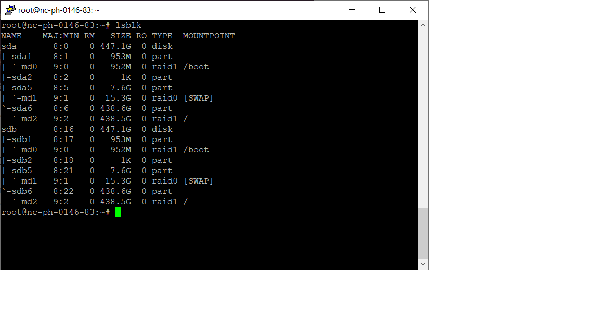
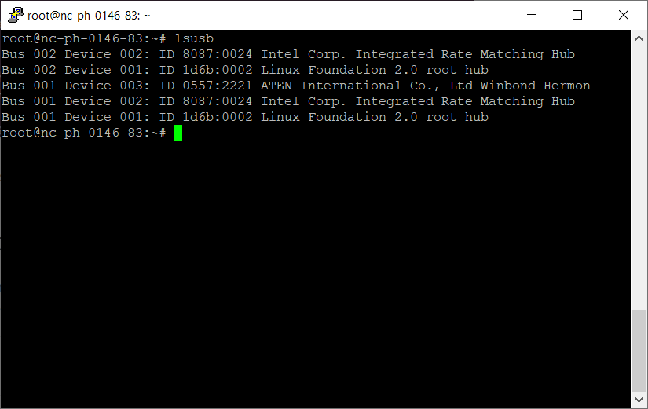
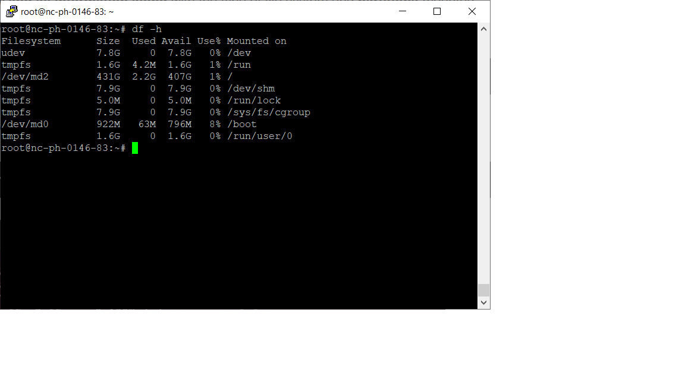
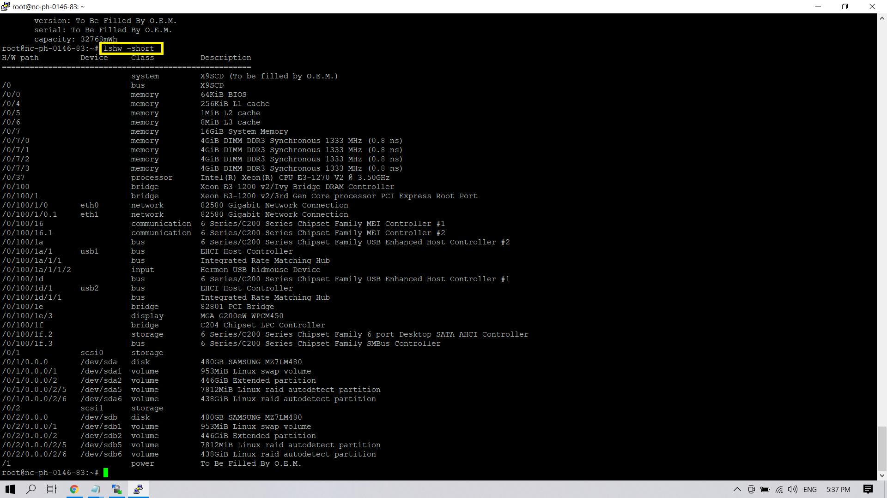
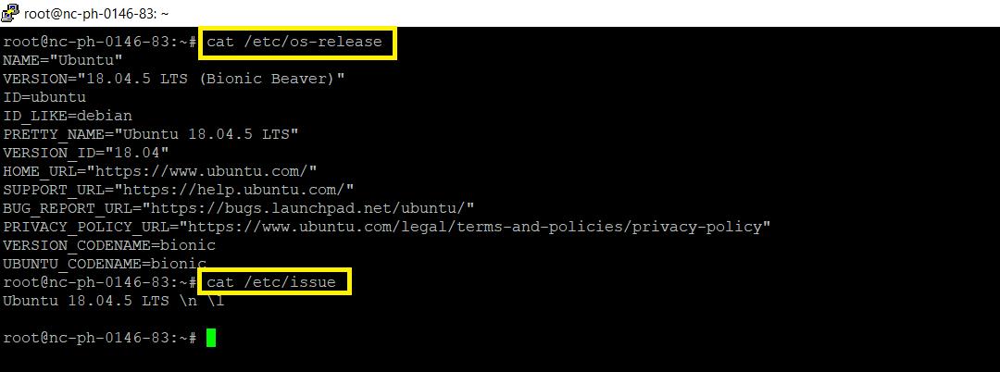

# Linux new machine hardware information
> uname -a

## Machine Hardware Architecture
> uname --m

## Hardware Information with lshw
> sudo lshw

## Short Summary
> lshw -short

## CPU Information with lscpu
> lscpu

## Block Device Information with lsblk
> lsblk

## USB Device Information with lsusb
> lsusb

## Disk information Human readable
> df -h

## Check Network card information
> lspci | grep -i 'eth'

## Short summary
> lshw -short

## Find out the IP address 
> ip addr

## Command to get complete Linux OS Info
> cat /etc/os-release

